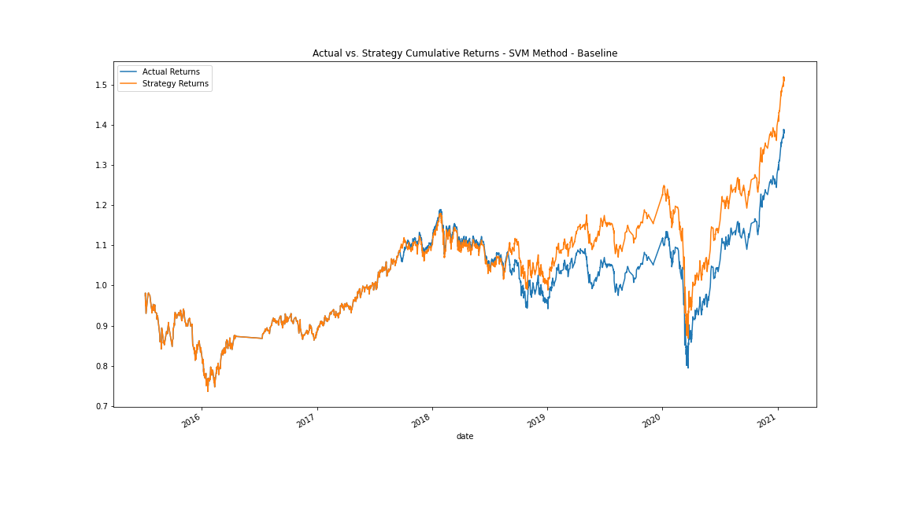
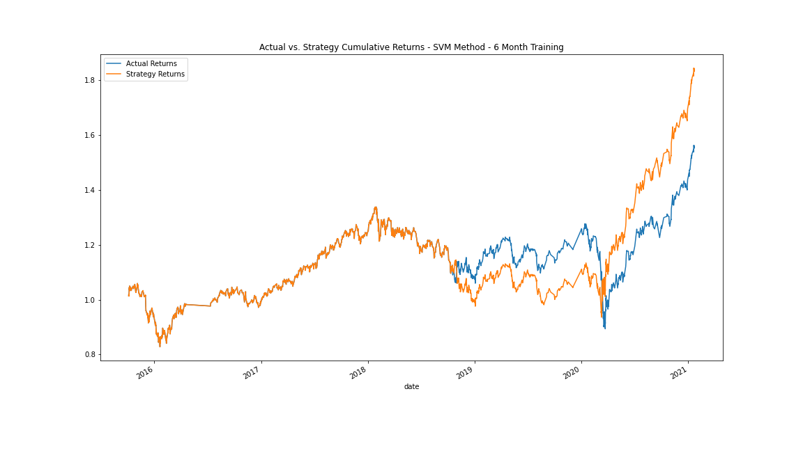
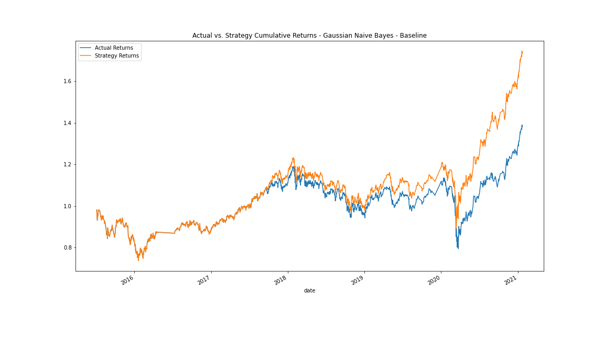

# Module_14 - Algorithmic Trading

As a financial advisor at one of the top five financial advisory firms in the world, I am constantly competing with the other major firms to manage and automatically trade assets in a highly dynamic environment.  In recent years, we have heavily profited by using computer algorithms that can buy and sell faster than human traders.  The speed of these transactions gave my firm a competitive advantage early on.  But people still need to specifically program these systems, which limits our ability to adapt to new data.  Therefore we are planning to improve the existing algorithmic trading systems and maintain the firm's competitive advantage in the market. To do so, I’ll enhance the existing trading signals with machine learning algorithms that can adapt to new data.

   

## Baseline Trading Algorithm

The baseline trading algorithm uses the SVC classifier model from SKLearn's support vector machine (SVM) learning method to fit the training data and make predictions based on the testing data.  The training data for this baseline uses the first 3 months of actual return data.  The trading signals use short- and long-window SMA values, with a short window of 4 days and a long windown of 100 days.  Cumulative returns were as follows:

   

## Tuning the Baseline Trading Algorithm

* Step 1: Tune the training algorithm by adjusting the size of the training dataset.
  * Decreasing the training dataset from 3 months to just one month produced slightly lower strategy returns
  * Increasing the training dataset to 6 months increased the cumulative strategy returns from about 50% to approximately 80%

* Step 2: Tune the trading algorithm by adjusting the SMA input features.
  * Increasing the slow SMA window from 100 days to 200 days resulted in much lower strategy returns
  * Increasing the fast SMA window from 4 days to 10 days also reduced the strategy returns, but not as much as the change above
  * Decreasing teh slow SMA window to 50 days also had a negative effect, though much smaller than the two changes above

* Step 3: Choose the set of parameters that best improved the trading algorithm returns.
  * The optimal trading algorithm uses baseline SMA windows of 4 days and 100 days, but increases the training period to 6 months from the baseline of 3 months.  Cumulative strategy returns for this tuned trading algorithm are shown below:
  
     

## Evaluate a New Machine Learning Classifier

After trying several differnt new machine learning models (including AdaBoost, Decision Tree Classifier, or Logistic Regression), I finally found one that improved on the results from the baseline model.  The Gaussian Naive Bayes classifier garnered a cumulative strategy return of nearly 70% compared to the 50% cumulative return from the baseline model.  This 70% return, however, was still less than the 80% achieved by tuning the baseline trading algortithm.

   
   
## Summary Evaluation Report

In summary, I'd recommend using a 6-month training data set.  This longer training period seems to much better at predicting future downturns in the market, allowing the algorithm to trade out of the market in time to avoid huge losses. While this longer training period results in slightly lower returns during bull markets, it clearly kept our investments from tanking during the bear market during the start of COVID in 2020 (see the second graph above compared with the other two graphs).  As for which type of machine learning classifier to use, the SVM model seems adequate enough to produce results that beat the market returns.  It may be worth considering using the Gaussian Naive Bayes method combined with the 6 month training period dataset to see if that combination produces superior results.

## Contributors

Starter code was provided by UW Fintech Bootcamp.  Updates and analysis by Jason Buckholt.  

---

## License

MIT License

Copyright (c) 2022 Jason Buckholt

Permission is hereby granted, free of charge, to any person obtaining a copy of this software and associated documentation files (the "Software"), to deal in the Software without restriction, including without limitation the rights to use, copy, modify, merge, publish, distribute, sublicense, and/or sell copies of the Software, and to permit persons to whom the Software is furnished to do so, subject to the following conditions:

The above copyright notice and this permission notice shall be included in all copies or substantial portions of the Software.

THE SOFTWARE IS PROVIDED "AS IS", WITHOUT WARRANTY OF ANY KIND, EXPRESS OR IMPLIED, INCLUDING BUT NOT LIMITED TO THE WARRANTIES OF MERCHANTABILITY, FITNESS FOR A PARTICULAR PURPOSE AND NONINFRINGEMENT. IN NO EVENT SHALL THE AUTHORS OR COPYRIGHT HOLDERS BE LIABLE FOR ANY CLAIM, DAMAGES OR OTHER LIABILITY, WHETHER IN AN ACTION OF CONTRACT, TORT OR OTHERWISE, ARISING FROM, OUT OF OR IN CONNECTION WITH THE SOFTWARE OR THE USE OR OTHER DEALINGS IN THE SOFTWARE.